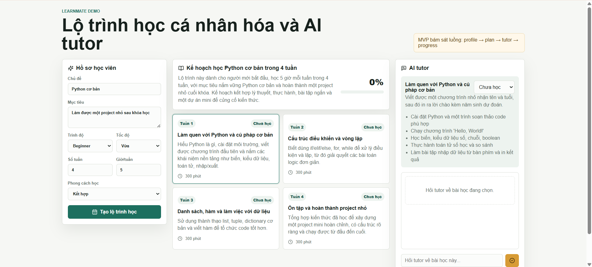

# LearnBuddy

LearnBuddy là ứng dụng học tập cá nhân hóa bằng LLM, dựa trên bài báo LearnMate. Người học nhập chủ đề, mục tiêu, trình độ, thời lượng và phong cách học; hệ thống tạo lộ trình học riêng, chia bài theo tuần, gợi ý hoạt động, checkpoint, quiz và hỗ trợ hỏi đáp với AI tutor theo từng bài học.

Bài báo gốc: [LearnMate: Enhancing Online Education with LLM-Powered Personalized Learning Plans and Support](https://arxiv.org/abs/2503.13340)

## Giao diện demo



## Chạy local

```powershell
npm install
npm run dev
```

Configure the LLM directly in this project with `.env.local`:

```powershell
LLM_PROVIDER=openai
OPENAI_API_KEY=<openai-api-key>
OPENAI_BASE_URL=https://api.openai.com/v1
OPENAI_CHAT_MODEL=gpt-4.1-mini
CHAT_MODEL=gpt-4.1-mini
```

For a local OpenAI-compatible runtime such as Ollama:

```powershell
LLM_PROVIDER=local
LOCAL_LLM_BASE_URL=http://127.0.0.1:11434/v1
LOCAL_LLM_API_KEY=local
LOCAL_CHAT_MODEL=qwen2.5:7b-instruct
CHAT_MODEL=qwen2.5:7b-instruct
```

Tạo file `.env.local` nếu muốn enrich video YouTube bằng metadata thật:

```powershell
YOUTUBE_API_KEY=<youtube-data-api-key>
```

Khi có key, backend dùng YouTube Data API để lấy tên video, thời lượng và description, sau đó parse chapter/timestamp từ description nếu video có. Nếu chưa có key, app chỉ có thể lấy title công khai qua oEmbed và sẽ fallback cho duration/timestamp.

Mở:

```text
http://127.0.0.1:3000
```

## Luồng chính

1. Nhập hồ sơ học viên: chủ đề, mục tiêu, trình độ, số tuần, giờ/tuần, tốc độ và phong cách học.
2. Tạo lộ trình học cá nhân hóa.
3. Chọn từng lesson để xem checkpoint, hoạt động học và cập nhật trạng thái.
4. Hỏi AI tutor theo ngữ cảnh lesson đang chọn.

## Build Docker

```powershell
docker build -t <dockerhub-username>/learnbuddy:latest .
docker run --rm -p 3000:3000 <dockerhub-username>/learnbuddy:latest
```

Nếu muốn dùng OpenAI thật, truyền env khi chạy container:

```powershell
docker run --rm -p 3000:3000 `
  -e LLM_PROVIDER=openai `
  -e OPENAI_API_KEY=<your-api-key> `
  -e OPENAI_BASE_URL=https://api.openai.com/v1 `
  -e OPENAI_CHAT_MODEL=gpt-5.4-mini `
  -e CHAT_MODEL=gpt-5.4-mini `
  <dockerhub-username>/learnbuddy:latest
```
Hiện tại có thể chạy dự án bằng lệnh 

```powershell
docker run --rm -p 3000:3000 `
  -e LLM_PROVIDER=openai `
  -e OPENAI_API_KEY=<api-key-cua-ho> `
  -e OPENAI_BASE_URL=https://api.openai.com/v1 `
  -e OPENAI_CHAT_MODEL=gpt-5.4-mini `
  -e CHAT_MODEL=gpt-5.4-mini `
  maitung123/learnmate-demo:latest
```
## Hướng mở rộng

- Adaptive plan: tự điều chỉnh lộ trình dựa trên bài đã hoàn thành, phần cần ôn và điểm quiz.
- Calendar view: chuyển agenda thành lịch tuần/ngày.
- Quiz evaluator: chấm câu trả lời ngắn và ghi lại weak topics.
- Teacher dashboard: theo dõi tiến độ nhiều học viên.
- RAG extension: upload PDF/slide/giáo trình rồi tạo plan và tutor answer dựa trên tài liệu thật.
